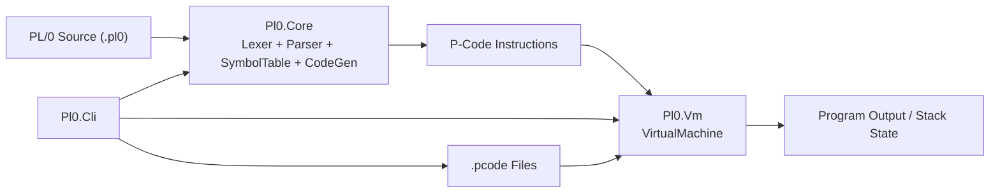

# TinyPl0 Architektur

## Überblick
TinyPl0 ist in drei Laufzeitmodule getrennt:

## Module
- `Pl0.Core`: Sprachverarbeitung und Codegenerierung.
- `Pl0.Vm`: Stackbasierte P-Code-Ausführung inklusive I/O-Adapter.
- `Pl0.Cli`: Bedienoberfläche (`compile`, `run`, `run-pcode`) und Dateifluss.

## Datenfluss
1. `.pl0` wird im Core lexikalisch analysiert.
2. Parser erzeugt aus Tokens P-Code-Instruktionen.
3. CLI kann P-Code als `.pcode` speichern oder direkt ausführen.
4. VM interpretiert Instruktionen deterministisch auf einem Integer-Stack.

## Pascal -> C# Mapping (Kompakt)
| Pascal-Referenz | C#-Implementierung |
|---|---|
| `getsym/getch` | `Pl0Lexer` |
| `block/statement/condition/expression` | `Pl0Parser` |
| `enter/position/table` | `SymbolTable` + `SymbolEntry` |
| `gen` | `Pl0Parser.Emit` |
| `interpret` | `VirtualMachine.Run` |
| `base(l)` | `VirtualMachine.ResolveBase` |
| `PrintUsage` | `CliHelpPrinter` |

## Dialekte
- `Classic`: ohne `?`/`!`, nahe am Pascal-Vorbild.
- `Extended`: mit `? ident` und `! expression`.
