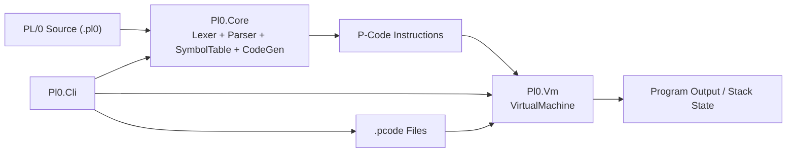

# TinyPl0 Architektur

## Überblick
TinyPl0 ist in drei Laufzeitmodule getrennt:

```mermaid
flowchart LR
  A["PL/0 Source (.pl0)"] --> B["Pl0.Core\nLexer + Parser + SymbolTable + CodeGen"]
  B --> C["P-Code Instructions"]
  C --> D["Pl0.Vm\nVirtualMachine"]
  D --> E["Program Output / Stack State"]
  F["Pl0.Cli"] --> B
  F --> D
  F --> G[".pcode Files"]
  G --> D
```

## Module
- `Pl0.Core`: Sprachverarbeitung und Codegenerierung.
- `Pl0.Vm`: Stackbasierte P-Code-Ausführung inklusive I/O-Adapter.
- `Pl0.Cli`: Bedienoberfläche (`compile`, `run`, `run-pcode`) und Dateifluss.

## Datenfluss
1. `.pl0` wird im Core lexikalisch analysiert.
2. Parser erzeugt aus Tokens P-Code-Instruktionen.
3. CLI kann P-Code als `.pcode` speichern oder direkt ausführen.
4. VM interpretiert Instruktionen deterministisch auf einem Integer-Stack.

## Pascal -> C# Mapping (Kompakt)
| Pascal-Referenz | C#-Implementierung |
|---|---|
| `getsym/getch` | `Pl0Lexer` |
| `block/statement/condition/expression` | `Pl0Parser` |
| `enter/position/table` | `SymbolTable` + `SymbolEntry` |
| `gen` | `Pl0Parser.Emit` |
| `interpret` | `VirtualMachine.Run` |
| `base(l)` | `VirtualMachine.ResolveBase` |
| `PrintUsage` | `CliHelpPrinter` |

## Dialekte
- `Classic`: ohne `?`/`!`, nahe am Pascal-Vorbild.
- `Extended`: mit `? ident` und `! expression`.

## VM-Ressourcenpolicy / VM Resource Policy

Deutsch: Die VM validiert ein positives Instruktionsbudget und eine Stackgröße
von `3` bis `1_000_000`, bevor sie `StackSize + 1` berechnet oder Speicher
allokiert. Batch und Step führen höchstens `N` Instruktionen aus und melden vor
`N+1` denselben terminalen Fehler. Diese Defense-in-Depth-Policy ergänzt
Pointer-/Stackprüfungen; sie ist keine Zeit- oder Betriebssystemgarantie.

English: The VM validates a positive instruction budget and a stack size from
`3` to `1,000,000` before calculating `StackSize + 1` or allocating memory.
Batch and step execution run at most `N` instructions and report the same
terminal error before `N+1`. This policy complements pointer/stack checks and
does not claim time or operating-system isolation.
## Einbettbare VM und Paketgrenze / Embeddable VM and Package Boundary

Deutsch: Pl0.Core bleibt abhängigkeitsfrei. Pl0.Vm hängt ausschließlich von
exakt derselben TinyPl0.Core-Paketversion ab. Innerhalb von Pl0.Vm besitzt
VmExecutionSession Programm, Stack, Register, Grenzen, Cancellation,
Diagnosen und den terminalen Cache. Nur diese Session dekodiert Instruktionen.
Batch-Run und Step-Debugging sind Adapter auf denselben Kernel. Die
Vertrauensgrenze liegt vor Options-/P-Code-Validierung und Stackallokation.

*English: Pl0.Core remains dependency-free. Pl0.Vm depends only on the exact
matching TinyPl0.Core package version. VmExecutionSession owns the program,
stack, registers, limits, cancellation, diagnostics, and terminal cache. It is
the only instruction decoder; batch and debug execution adapt the same kernel.
The trust boundary precedes validation and stack allocation.*
